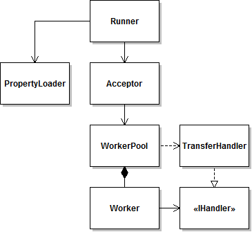

# java-port-mapper
Java NIO proxy example

That was my 1st experience using Java NIO. The application accepts socket connections on different ports and proxies 
them to different distinations.

Now I'd rather use standard [Thread Pools](https://docs.oracle.com/javase/tutorial/essential/concurrency/pools.html) 
than implement my own, see the class diagram:

